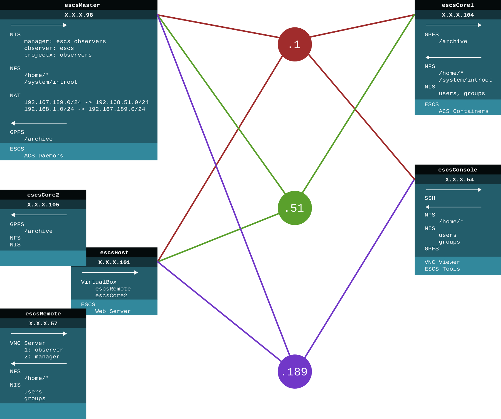

Cabling scheme
--------------

Network cabling is realized connecting the machines to two different devices:
subnets 192.168.1.0/24 and 192.168.51.0/24 are configured directly on the HP
Router in the control room, while public subnet 192.167.189.0/24 is configured
on the control room HP switch.

+------------+--------+-------------------+------+
|Machine     | Subnet | Network Apparatus | Port |
+============+========+===================+======+
| escsMaster |  .189  | Switch            |  17  |
|            +--------+-------------------+------+
|            |  .1    | Router            |  1   |
|            +--------+-------------------+------+
|            |  .51   | Router            |  2   |
+------------+--------+-------------------+------+
| escsHost   |  .189  | Switch            |  18  |
|            +--------+-------------------+------+
|            |  .1    | Router            |  5   |
|            +--------+-------------------+------+
|            |  .51   | Router            |  6   |
+------------+--------+-------------------+------+
| escs Core1 |  .1    | Router            |  7   |
|            +--------+-------------------+------+
|            |  .51   | Router            |  8   |
+------------+--------+-------------------+------+
| escsConsole|  .1    | Router            |  3   |
|            +--------+-------------------+------+
|            |  .189  | Switch            |  16  |
+------------+--------+-------------------+------+

A schematic of network services and connections can be seen in the following
figure:

